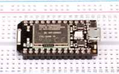

# EmonCore
Open Energy Monitor - All in One for the Spark Core/Photon

Based on work done in the [emonBase/NanodeRF](http://openenergymonitor.org/emon/emonBase/NanodeRF) project.

This project aims in the same single unit direction as emonPi but sticks with arduino type programing and aims for a smaller form factor. 

Currently there is no support for RFM12B or RFM69CW devices.  

### Features

- Built in WiFi
- 8 12-bit Analog Channels
- 73Mhz ARM Cortex M3
- Flash via Web

## Guide

